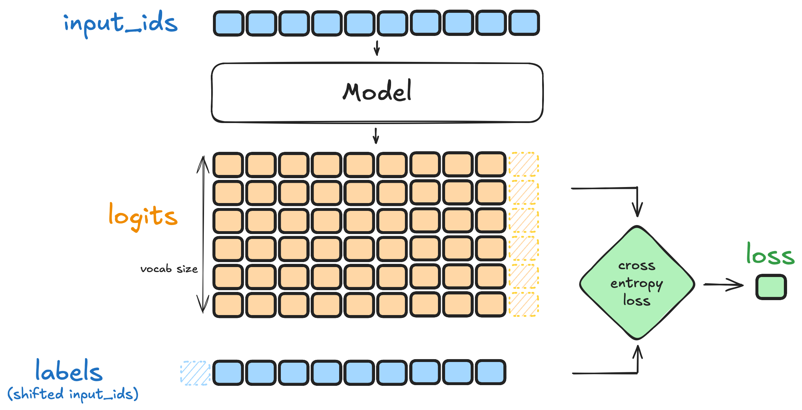

# Understanding the SFT Negative Log-Likelihood Loss

Supervised fine-tuning (SFT) teaches a causal language model to reproduce the target tokens in a collection of high-quality examples. For one target sequence, the loss is:

```math
\mathcal{L}_{\mathrm{SFT}}(\theta)
=
-\sum_{t=1}^{T}
\log p_\theta(y_t\mid y_1,\ldots,y_{t-1})
```

For instruction tuning, the model is normally conditioned on a prompt $x$ as well:

```math
\mathcal{L}_{\mathrm{SFT}}(\theta)
=
-\sum_{t=1}^{T}
\log p_\theta(y_t\mid x,y_1,\ldots,y_{t-1})
```

The second form makes the prompt explicit. It is the form most relevant to fine-tuning an instruction model such as Qwen2.5.

## Meaning of the Terms

- $\theta$ is the collection of trainable Qwen2.5 parameters.
- $x$ is the prompt or conversation context.
- $y=(y_1,\ldots,y_T)$ is the target assistant response after tokenization.
- $y_t$ is the correct target token at response position $t$.
- $y_1,\ldots,y_{t-1}$ are the earlier target tokens available when predicting $y_t$.
- $T$ is the number of target tokens included in the loss.
- $p_\theta(y_t\mid x,y_1,\ldots,y_{t-1})$ is the probability that Qwen2.5 assigns to the correct next token.
- $\log$ is the natural logarithm.
- The leading minus sign turns high correct-token probability into low loss.

For example, suppose the training sample is:

```text
Prompt:   What is the capital of France?
Response: Paris is the capital of France.
```

At each response position, Qwen2.5 receives the prompt and all preceding tokens. It is trained to assign a high probability to the next token from the reference response.

## From Qwen2.5 Architecture to the Loss

Qwen2.5 is a decoder-only causal Transformer. The following stages connect its architecture to the probability in the SFT loss.

### 1. Tokenization

The tokenizer converts the formatted prompt and response into token IDs:

```math
(x,y)\longrightarrow(s_1,s_2,\ldots,s_N)
```

The sequence can contain system, user, and assistant-role markers inserted by Qwen2.5's chat template. Some positions belong to the prompt and others belong to the target response.

### 2. Input Embeddings

Each input token ID indexes Qwen2.5's learned embedding matrix:

```math
\mathbf{e}_i=E_\theta[s_i]
```

Here, $E_\theta$ is the token-embedding matrix and $\mathbf{e}_i$ is the vector representation of token $s_i$. Qwen2.5 also uses positional information so the Transformer can distinguish token order.

### 3. Causal Transformer Layers

The embeddings pass through Qwen2.5's stack of causal Transformer decoder layers:

```math
\mathbf{h}_i
=
F_\theta(\mathbf{e}_1,\ldots,\mathbf{e}_i)
```

$F_\theta$ represents the complete Transformer stack, including causal self-attention, normalization, and feed-forward computations. The causal attention mask prevents position $i$ from seeing future tokens.

Consequently, $\mathbf{h}_i$ summarizes only the prompt and tokens available through position $i$.

### 4. Vocabulary Logits

The language-model head projects the final hidden state into one score per vocabulary token:

```math
\mathbf{z}_i
=
W_{\mathrm{LM}}\mathbf{h}_i
```

- $\mathbf{h}_i$ is the final hidden state at position $i$.
- $W_{\mathrm{LM}}$ is the language-model output matrix.
- $\mathbf{z}_i\in\mathbb{R}^{|V|}$ is the logits vector.
- $|V|$ is the size of Qwen2.5's vocabulary.

A logit is an unnormalized score. Larger logits correspond to larger predicted probabilities after normalization.

### 5. Next-Token Probabilities

Softmax converts the vocabulary logits into a probability distribution:

```math
p_\theta(v\mid s_1,\ldots,s_i)
=
\frac{\exp(z_{i,v})}
{\sum_{u\in V}\exp(z_{i,u})}
```

Here, $z_{i,v}$ is the logit for vocabulary token $v$. The probabilities over all vocabulary tokens sum to one:

```math
\sum_{v\in V}p_\theta(v\mid s_1,\ldots,s_i)=1
```

To predict target token $y_t$, training selects the probability assigned to that token from the full vocabulary distribution:

```math
p_\theta(y_t\mid x,y_1,\ldots,y_{t-1})
```

## Why the Logarithm and Minus Sign Are Used

The probability of the complete target response factorizes autoregressively:

```math
p_\theta(y\mid x)
=
\prod_{t=1}^{T}
p_\theta(y_t\mid x,y_1,\ldots,y_{t-1})
```

Taking the logarithm converts the product into a sum:

```math
\log p_\theta(y\mid x)
=
\sum_{t=1}^{T}
\log p_\theta(y_t\mid x,y_1,\ldots,y_{t-1})
```

Training maximizes this sequence log-likelihood. Optimizers are conventionally written to minimize an objective, so SFT minimizes its negative:

```math
-\log p_\theta(y\mid x)
=
-\sum_{t=1}^{T}
\log p_\theta(y_t\mid x,y_1,\ldots,y_{t-1})
```

If the model assigns high probability to the correct token, its contribution to the loss is small. For example:

```math
-\log(0.9)\approx0.105
```

If the model assigns low probability to the correct token, the penalty is much larger:

```math
-\log(0.01)\approx4.605
```

## Teacher Forcing and Label Shifting

During SFT, Qwen2.5 uses **teacher forcing**. The input contains the ground-truth sequence, and the label at each position is shifted by one token:

```text
Input:   [token 1, token 2, token 3, token 4]
Labels:  [token 2, token 3, token 4, token 5]
```

The hidden state produced after `token 3` is therefore evaluated against the ground-truth `token 4`, even if the model would have generated a different token by sampling. All token losses can be computed in one parallel forward pass, although the causal mask preserves the autoregressive dependency.

## Masking Prompt and Padding Tokens

In instruction SFT, trainers often compute loss only on assistant-response tokens. A binary mask $m_i$ indicates which positions should contribute:

```math
m_i
=
\begin{cases}
1, & \text{if position } i \text{ is a supervised response token},\\
0, & \text{if position } i \text{ is prompt or padding}.
\end{cases}
```

The mean masked loss for one sequence is:

```math
\mathcal{L}_{\mathrm{masked}}(\theta)
=
-\frac{1}{\sum_i m_i}
\sum_i m_i\log p_\theta(s_{i+1}\mid s_1,\ldots,s_i)
```

In PyTorch and Hugging Face code, ignored labels are commonly set to `-100`. Cross-entropy then excludes those positions. Whether prompt tokens are masked depends on the trainer and data-collator configuration.

## Batch Loss

For a batch of $B$ examples, the trainer commonly averages over all supervised tokens:

```math
\mathcal{L}_{\mathrm{batch}}(\theta)
=
-\frac{1}{N_{\mathrm{target}}}
\sum_{b=1}^{B}\sum_i
m_i^{(b)}
\log p_\theta
\left(s_{i+1}^{(b)}\mid s_1^{(b)},\ldots,s_i^{(b)}\right)
```

$N_{\mathrm{target}}$ is the total number of unmasked target tokens in the batch.

## Equivalent Cross-Entropy Form

Let $q_{i,v}$ be a one-hot target distribution that equals one for the correct next token and zero for every other vocabulary token. The token loss can also be written as categorical cross-entropy:

```math
\ell_i
=
-\sum_{v\in V}q_{i,v}\log p_{i,v}
=
-\log p_{i,y_i}
```

This is why model-training libraries often call the implementation `cross_entropy`, even though the SFT objective is also described as negative log-likelihood.

## How Training Changes Qwen2.5

Backpropagation computes the gradient of the loss with respect to the trainable parameters:

```math
\nabla_\theta\mathcal{L}_{\mathrm{SFT}}(\theta)
```

An optimizer then updates those parameters:

```math
	heta
\longleftarrow
	heta-\eta\nabla_\theta\mathcal{L}_{\mathrm{SFT}}(\theta)
```

$\eta$ is the learning rate. Depending on the fine-tuning method, $\theta$ can mean:

- All Qwen2.5 parameters during full fine-tuning.
- Only adapter parameters during LoRA or QLoRA fine-tuning.

The update increases the logits and probabilities of target tokens in contexts similar to the training examples. Repeating this process teaches Qwen2.5 the desired response style, task behavior, formatting, and domain knowledge represented in the SFT dataset.

## End-to-End Summary

For each training example, SFT performs the following steps:

1. Apply Qwen2.5's chat template and tokenize the prompt and target response.
2. Map token IDs to embeddings.
3. Run the embeddings through the causal Transformer layers.
4. Project each final hidden state through the language-model head.
5. Apply softmax to obtain a distribution over the vocabulary.
6. Read the probability assigned to each ground-truth next token.
7. Mask prompt and padding positions when configured to do so.
8. Sum or average the negative log probabilities.
9. Backpropagate the loss and update the trainable parameters.

SFT therefore does not add a special loss head to Qwen2.5. It uses the model's existing vocabulary logits and trains them with next-token cross-entropy, or equivalently negative log-likelihood.